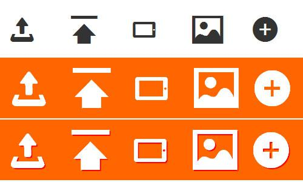
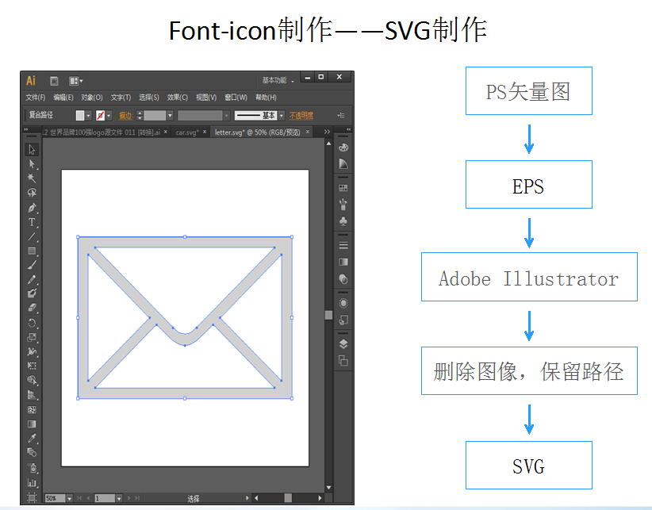
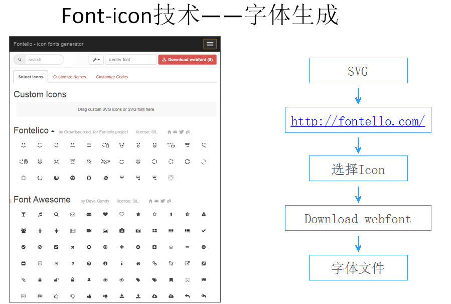

# font-icon的应用 #

----------

## 什么是字体图标？ ##
简单来说，看起来是图标，实际上是文字,

文字因为字体的不同而呈现出不同的外观，

现在各个浏览器都支持CSS3的自定义字体(@font-face)，包括IE6都支持，只是各自对字体文件格式的支持不太一样。那么对于网站中用到的各种icon，我们就可以尝试使用font来实现

## 字体图标能解决什么问题？ ##

在很多网站项目中，我们常常会用到各种透明小图标，然后网站要**兼容各个浏览器**，也可能会有**多个尺寸**，甚至还要考虑**换肤等需求**。那么我们就要将这些小图标输出为多种尺寸、颜色和文件格式，比如png8 alpha透明或者png8 index透明等。

一般雪碧图

1. 相同形状但颜色不同的图标
1. 相同形状但大小不同的图标
1. 由于要兼容IE6的半透明，有时还要把图标周围的背景色也一并截下
1. 放大后图标变得模糊

字体图标

1. 随意改变颜色
1. 随意改变大小
1. 配合css3可以添加透明、变形、阴影等效果
1. 兼容IE6

这种情况下，使用字体来实现图标就有很多优势：
字体文件小，一般20-50kb；
容易编辑和维护，尺寸和颜色可以用css来控制；
透明完全兼容IE6；

## 如何制作字体图标？ ##

## 如何使用字体图标？ ##

因为不同的浏览器对字体格式支持是不一致的，所以需要对不同浏览器提供不同的字体格式做兼容：

一、TureTpe(.ttf)格式：

.ttf字体是Windows和Mac的最常见的字体，是一种RAW格式，因此他不为网站优化,支持这种字体的浏览器有【IE9+,Firefox3.5+,Chrome4+,Safari3+,Opera10+,iOS Mobile Safari4.2+】；

二、OpenType(.otf)格式：

.otf字体被认为是一种原始的字体格式，其内置在TureType的基础上，所以也提供了更多的功能,支持这种字体的浏览器有【Firefox3.5+,Chrome4.0+,Safari3.1+,Opera10.0+,iOS Mobile Safari4.2+】；

三、Web Open Font Format(.woff)格式：

.woff字体是Web字体中最佳格式，他是一个开放的TrueType/OpenType的压缩版本，同时也支持元数据包的分离,支持这种字体的浏览器有【IE9+,Firefox3.5+,Chrome6+,Safari3.6+,Opera11.1+】；

四、Embedded Open Type(.eot)格式：

.eot字体是IE专用字体，可以从TrueType创建此格式字体,支持这种字体的浏览器有【IE4+】；

五、SVG(.svg)格式：

.svg字体是基于SVG字体渲染的一种格式,支持这种字体的浏览器有【Chrome4+,Safari3.1+,Opera10.0+,iOS Mobile Safari3.2+】。

使用@font-face把自己定义的Web字体嵌入到你的网页中

    @font-face {
    font-family: 'iconfont';
    src: url('iconfont.eot'); /* IE9*/
    src: url('iconfont.eot?#iefix') format('embedded-opentype'), /* IE6-IE8 */
       url('iconfont.woff') format('woff'), /* chrome、firefox */
       url('iconfont.ttf') format('truetype'), /* chrome、firefox、opera、Safari, Android, iOS 4.2+*/
       url('iconfont.svg#iconfont') format('svg'); /* iOS 4.1- */
    }
    
    .iconfont{
    font-family:"iconfont" ;
    font-size:16px;
    font-style:normal;
    -webkit-font-smoothing: antialiased;
    -webkit-text-stroke-width: 0.2px;
    -moz-osx-font-smoothing: grayscale;
    }

## 字体图标的优缺点对比 ##
    
    @font-face 的优点
    1、应用场景：在多组形状一致但大小、颜色不一的图标重复出现的情况下。
    2、可以改变的图标大小和颜色
    3、减少图片数量，增加图标复用性
    4、免去拼图、定位的工作。
    5、IE6完全支持font-icon的透明效果，无需考虑PNG24的半透明、滤镜问题

----------

    @font-face 的缺点
    1.只能处理单色图标，不能处理多色图标
    2.虽然浏览器支持，但是，由于各个浏览器支持的字体format不同，绘制出来的字体图标效果参差不齐。出现锯齿，毛边的现象。
    3.在页面中引入无意义的内容
    4.编码。
    5.最后也是最重要的一点，虽然font-icon能够做很多事情，但是一旦用户设置浏览器禁用网络字体，一切努力全部白搭。

## 拓展##

随着font-icon技术越来越成熟，很多网站已经应用并做出了很多自动化工具给开发者使用

著名的bootstrap在升级到3以后的版本已经放弃了图片图标，转而采用了字体图标技术

http://www.iconfont.cn/  淘宝的矢量图标库工具已经相当成熟了，淘宝和天猫上的很多图标都已经采用了字体图标技术

网易邮箱团队也在6.0版做了字体图标的尝试并公布了非常有用的用户使用数据。

图标字体化浅谈： [http://isux.tencent.com/icon-font.html](http://isux.tencent.com/icon-font.html)
CSS3 @font-face：  [http://www.w3cplus.com/content/css3-font-face](http://http://www.w3cplus.com/content/css3-font-face)
如何把你的图标转换成web字体：[http://www.w3cplus.com/css3/how-to-turn-your-icons-into-a-web-font.html](http://www.w3cplus.com/css3/how-to-turn-your-icons-into-a-web-font.html)
阿里巴巴矢量图标库的矢量图标应用教程：[http://www.iconfont.cn/help/iconuse.html](http://www.iconfont.cn/help/iconuse.html)

