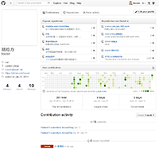

##Github是什么?
GitHub 是一个共享虚拟主机服务，用于存放使用Git版本控制的软件代码和内容项目。

GitHub同时提供付费账户和为开源项目提供的免费账户。允许个人和组织建立和存取代码库以外，它也提供了一些方便社会化软件开发的功能，包括允许用户跟踪其他用户、组织、软件库的动态，对软件代码的改动和 bug 提出评论等。GitHub也提供了图表功能，用于显示开发者们怎样在代码库上工作以及软件的开发活跃程度。

<div style="text-align: center">
	<a href="http://github.com" target="_blank"></a>
	<p style="color: #4183c4; font-weight: 800;">Github主页</p>
</div>

##Github有哪些功能？

* code lib
    *  pull线上一个代码仓库到本地
    *  push本地一个代码仓库到线上
    *  强大的分支管理
* github-page
* github-gist
* github-blog
* github-Issues
* 支持`markdown`语法
* 预览区域`代码高亮`

##有问题反馈
在使用中有任何问题，欢迎反馈给我，可以用以下联系方式跟我交流
 

##捐助开发者
 

##感激
感谢以下的项目,排名不分先后

 

##关于作者

```javascript
  var ihubo = {
    nickName  : "草依山",
    site : "http://jser.me"
  }
```