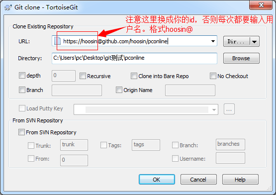

##Github是什么?
GitHub 是一个SNS共享虚拟主机服务，用于存放使用Git版本控制的软件代码和内容项目。

GitHub 同时提供付费账户和为开源项目提供的免费账户。允许个人和组织建立和存取代码库以外，它也提供了一些方便社会化软件开发的功能，包括允许用户跟踪其他用户、组织、软件库的动态，对软件代码的改动和 bug 提出评论等。GitHub也提供了图表功能，用于显示开发者们怎样在代码库上工作以及软件的开发活跃程度。


[Github首页](http://github.com/hoosin "Github首页") | 
[官方文档](https://help.github.com/articles/github-glossary "官方文档")
>国内类似的有：

>[Oschina](http://git.oschina.net/ "Oschina") | [Csdn](http://code.csdn.net "Csdn") 


##Github有哪些功能？

* [Code lib](http://github.com)
    *  Pull
    *  Push
    *  Fork
    *  Star
* [Github-page](http://hoosin.github.io/easyBtn/)
* [Github-gist](https://gist.github.com/)
* [Github-blog](https://github.com/blog)
* [Github-Issues](https://github.com/hoosin/easyBtn/issues?state=closed)
* 支持`Markdown`语法[Markdown语法](https://github.com/hoosin/MarkDown)
* 当然要是你够热爱github社区的话可以[猛戳这里](http://shop.github.com/ "github-shop")

##初探Github，你必须知道的事儿！

工欲善其事，必先利其器。
也就是说在使用Github之前，你必须有“吃饭的碗”。
>官方版是：[Github for windows](https://windows.github.com/)


###这里介绍的碗就是——Git。
>[了解更多有关 Git](http://git.oschina.net/progit/)

同生活中的许多伟大事件一样，Git 诞生于一个极富纷争大举创新的年代。Linux 内核开源项目有着为数众广的参与者。绝大多数的 Linux 内核维护工作都花在了提交补丁和保存归档的繁琐事务上（1991－2002年间）。到 2002 年，整个项目组开始启用分布式版本控制系统 BitKeeper 来管理和维护代码。

*简单来说Git是一个免费的、开源的版本控制软件，从功能上讲，跟我们比较熟悉的Subversion(SVN)这类版本控制软件没什么两样。*

####1. 安装Git
首先msysgit客户端，大家可以通过两种方式获取Git的软件，一个是在[官网](http://git-scm.com/)上获取，另一个可以点击这里[下载](https://code.google.com/p/msysgit/)。

>

>

>

>

>

>

>

>

>


####2. 安装TortoiseGit
写在最前面，什么是TortiseGit？TortoiseGit是Windows下不错的一款图形化Git客户端工具，她省去了你被一大通命令行的烦恼。

TortoiseGit的安装很简单，你只需[下载](https://code.google.com/p/tortoisegit/)客户端，安装就可以使用git的图形工具，至此，你已经可以像svn一样便捷的操作她了！

**特别注意的是，公司使用Git需要代理**


##我在Github，第一行代码 “hello world”

* 创建一个新项目

* 新建项目页面

* 创建好的code-lib

* 把code-lib从线上拉到本地 
将页面上HTTPS clone URL 

* pull图形界面



##Github-page

##Github-gist

##Github-issues


 

##关于此Markdown

```javascript
  var markdown = {
    name  : "github，想说爱你不容易",
    date  : "2014-4-16"
  }
```